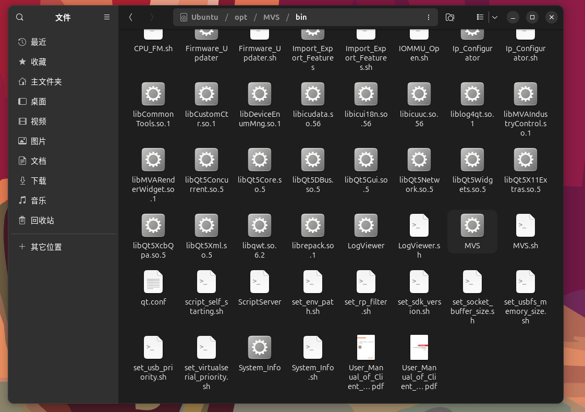
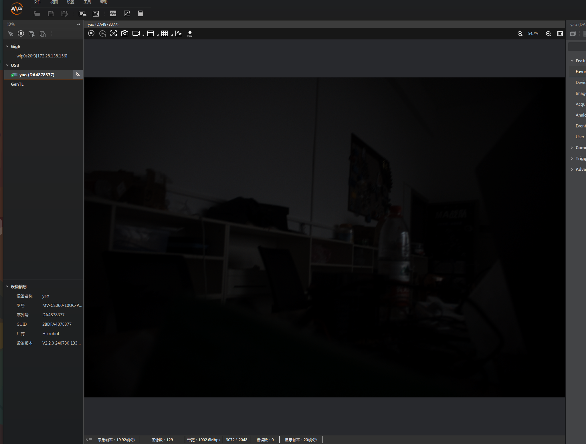
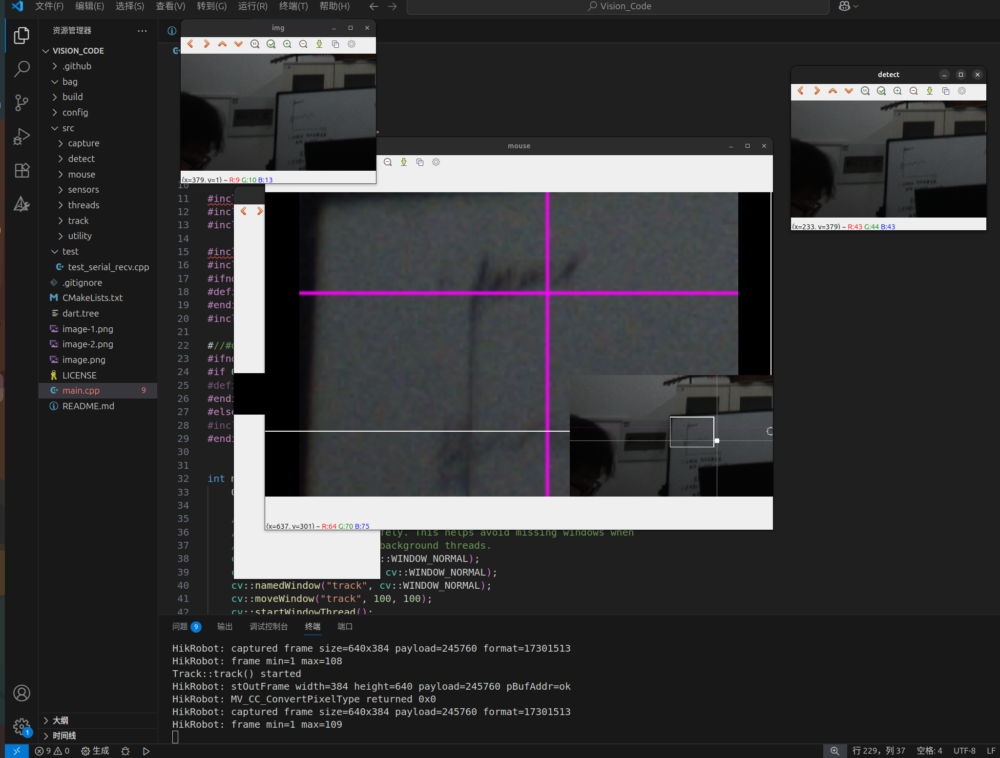

# ma_vision_code（Dart）

**技术栈：**

- C++17 / CMake
- OpenCV 4.x
- Qt5（GUI 主线程 / 定时器）
- FlatBuffers（数据通信）
- OpenVINO（推理加速）
- 工业相机 SDK（HikRobot / MindVision）

## 1. 安装必要工具

```bash
sudo apt update
sudo apt install -y \
  build-essential \
  cmake \
  git \
  pkg-config
```

## 2. 安装必需库

- OpenCV 4.x(>4.0)
- Qt5（用于 QApplication / QTimer）
- FlatBuffers
- pthreads（由系统提供）

```bash
# OpenCV
sudo apt install -y \
  libopencv-dev \
  libopencv-core-dev \
  libopencv-imgproc-dev \
  libopencv-highgui-dev

# Qt5
sudo apt install -y \
  qtbase5-dev \
  libqt5core5a \
  libqt5gui5 \
  libqt5widgets5

# FlatBuffers
sudo apt install -y flatbuffers-compiler libflatbuffers-dev
```

## 3. 安装openvino

- 进入[OpenVINO 文档](https://docs.openvino.ai/)学习安装

## 4. 安装相机sdk

#### hik：

- download：[海康威视官网](https://open.hikvision.com/#home)
- 下载成功后验证：打开/opt/MVS/bin/MVS（双击进入）
- 
- 如果驱动成功安装，则有相机实时显示画面
- 

#### mind:

- download: [迈德威视官网](https://www.mindvision.com.cn/download.aspx)

## 5. 整体代码框架

- 见[dart.tree](dart.tree)

## 6. 代码运行步骤及其效果

```bash
#前提要有串口发数据：给串口赋权
cd ~/Vision_Code
mkdir build
cd build
cmake ..
make -j
sudo chmod 777 /dev/ttyUSB0
sudo ./Dart
```

- 运行成功效果如下：
  

# 部分功能还在开发优化中......

---

## 致谢 / 参考

本项目基于开源项目：

- **原项目名称**：2024_Dart_Algorithm

- **原仓库地址**：https://github.com/Elucidater01/2024_Dart_Algorithm.git

- **原 License**：MIT License

本仓库对原项目做了重大修改，包括但不限于：

- 多线程视觉管线重构

- 基于 Qt 的 GUI 主线程显示

- 使用 atomic + shared_ptr 实现零拷贝帧传递

- 硬件相机 SDK 集成

- 增加test